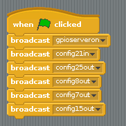
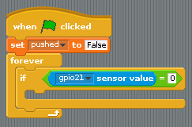
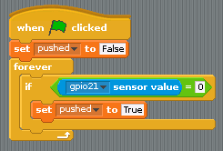
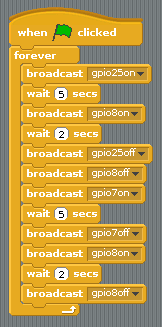
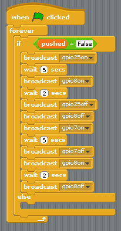
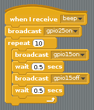
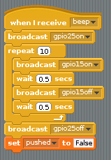

# Traffic Lights

For this worksheet you'll need a breadboard, three LEDs, a button, a buzzer, and the necessary jumper cables and resistors. You can purchase these individually, or get everything you need in [CamJam Kit 1](https://thepihut.com/products/camjam-edukit)

## Wiring

To get started, you'll need to place all the components on the breadboard and connect them to the Raspberry Pi.

1. First, you need to understand how each component is connected:

    - A button needs a GPIO pin and Ground
    - An LED needs a GPIO pin and Ground, but it also needs a resistor to protect it.
    - A buzzer needs a GPIO pin and Ground.

To save on using 5 different ground pins, you can just plug a single Gnd pin into the negative row on a breadboard. This is called a **common ground**

1. Place the components on the breadboard and connect them to the Raspberry Pi GPIO pins, as shown below.

    

1. This table shows which GPIO pin is connected to which component, in case you get lost:

| Component | GPIO pin |
| --------- | :------: |
| Button    | 21       |
| Red LED   | 25       |
| Amber LED | 8        |
| Green LED | 7        |
| Buzzer    | 15       |

## Setting up the scripts

1. Open up Scratch and save a new file.

1. The first step is to configure all the GPIO pins, so that they are set to be inputs and outputs. Use broadcast blocks as shown below.

    

2. Now use another `when greenflag clicked` block to set a variable called `pushed` to `False` when the script starts

    

3. Now use a `forever` loop to listen out for the button to be pushed.

    

4. And finally you can change the value of the `pushed` variable to `True` if the button is pushed.

    

## Basic traffic lights

1. Now you can create a basic traffic light sequence. The sequence for traffic lights is **Red**-->**Red/Amber**-->**Green**-->**Amber**, and constantly repeated. This is the perfect excuse for a loop.

2. The script below will create your basic traffic light sequence.

    

1. Test out the light sequence by clicking the `greenflag`

3. You want to be able to interrupt the sequence, when the button is pushed, to allow a pedestrian to cross to the road. An `if/else` block will help with this.

    

1. Test out the sequence, and then try pushing the button. The Traffic light sequence should finish and then stop.

## Crossing the road.

1. To help the visually impaired, a crossing normally beeps when it is safe to cross.

1. You can create a new broadcast to manage this. Call it `beep`. The first thing it should do is make sure the light is red.

1. Next you can use a `repeat` block to switch on and off the buzzer a few times.

1. Once the beeping has finished, the script should turn the red LED off, and then reset the `pushed` variable back to False.

1. Lastly, you can have the main script `broadcast beep and wait` when the button has been pushed.

1. And now you should have a working traffic light and crossing, all in Scratch.
