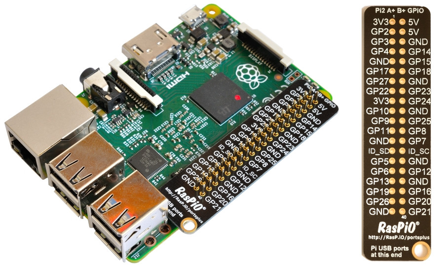
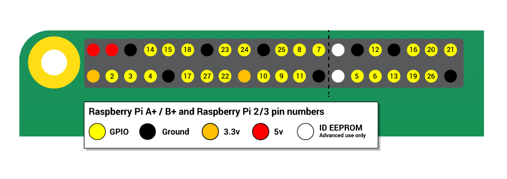
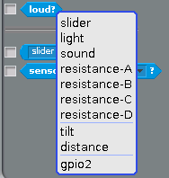
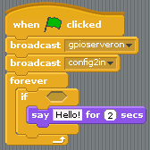
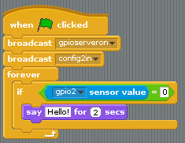

# Physical computing with Scratch

## GPIO ピン

One powerful feature of the Raspberry Pi is the row of GPIO pins along the top edge of the board. GPIO stands for General-Purpose Input/Output. These pins are a physical interface between the Raspberry Pi and the outside world. At the simplest level, you can think of them as switches that you can turn on or off (input) or that the Pi can turn on or off (output).

The GPIO pins allow the Raspberry Pi to control and monitor the outside world by being connected to electronic circuits. The Pi is able to control LEDs, turning them on or off, run motors, and many other things. It's also able to detect whether a switch has been pressed, the temperature, and light. We refer to this as physical computing.

Raspberry Piには40個のピン(初期のモデルでは26個のピン)が搭載されていて、様々な異なる機能を提供しています。

もしRasPiOピンラベルを持っていれば、それぞれのピンが何に使われるか確認する手助けになります。ピンラベルはキーリング用の穴が開いている方をUSBポート向きかつ外側になるように配置します。

持っていない場合は、以下のガイドが役立つでしょう。

You'll see pins labelled as 3V3, 5V, GND and GP2, GP3, etc:

|   |   |   |
|---|---|---|
| 3V3 | 3.3 ボルト | ここに接続されたすべてのものは常に3.3Vの電源を得ることができます |
| 5V | 5 ボルト | ここに接続されたすべてのものは常に5Vの電源を得ることができます |
| GND | グラウンド | 0ボルトは、回路を完成させるために使用します |
| GP2 | GPIO ピン 2 | These pins are for general-purpose use and can be configured as input or output pins |
| ID_SC/ID_SD/DNC | Special purpose pins ||

**注意**: If you follow the instructions, then playing about with the GPIO pins is safe and fun. Randomly plugging wires and power sources into your Pi, however, may destroy it, especially if using the 5V pins. Bad things can also happen if you try to connect things to your Pi that use a lot of power; LEDs are fine, motors are not. If you're worried about this, then you might want to consider using an add-on board such as the [Explorer HAT](https://shop.pimoroni.com/products/explorer-hat) until you're confident enough to use the GPIO directly.

## LEDを光らせる

You can test whether your GPIO pins and LEDs are working by building the circuit below. You can use any resistor over about 50Ω.

1. LEDを **GND** ピンに直接つなぎ、330オームの抵抗を経由して **3V3** ピンにつなぐと光るはずです

1. 必ず正しい方向でLEDを接続するために、脚が長い方を3V3ピン側に接続します

## LEDのオンオフを切り替えられるピンを使う

1. LEDを制御するには、切替可能なピンにつなぐ必要があります

1. 以下の回路では **ピン17**を使用していますが、他の番号がついたピンを使うこともできます

## Constructing a Scratch program

1.  Locate the Scratch program by clicking on **Menu** followed by **Programming**, and selecting **Scratch**.

 

1. The familiar Scratch interface will then load:

 

1.  Click on **Control** in the top-left display. Drag the `when GreenFlag clicked` block onto the scripts area:

  

1. Scratch uses **broadcast** blocks to communicate with the GPIO pins; the first broadcast you need is `gpioserveron` which activates the GPIO functionality:

  

1. As your GPIO pin can be used as either input or output, you'll need to specify in which mode your pin is being used with the `config17out` broadcast:

  

1. From this point on, you can control your LED using two broadcasts: `gpio17high` to turn it on and `gpio17low` to turn it off. Using these two messages and some pauses, you can make an LED flash continuously:

  

## Connecting a button

1. As well as controlling the physical world, you can react to it using an input device such as a button.

1. Connect your button to a breadboard, then connect one pin to a ground pin and the other to a numbered GPIO pin. In this example **pin 2** has been used:

## Configuring your button

1. Before Scratch can react to your button, it needs to be told which pin is configured as an input pin.

1. Assuming you have started a new Scratch file, you'll also need to start the GPIO server. The following code will configure pin 4 as an input:

  

1. Once you have built the code above, you need to click the green flag in order for it to run and for your pin to be set up.

1. Next, you need to go to the Sensing menu in Scratch:

  

1. From here you need to find the  block and click the triangle to reveal a menu. Select **gpio2** from the menu and click the tickbox to the left:

  

1. You should now see the current state of the pin in the stage area:

  

1. Now when you press your button, the state should change from 1 to 0.

## Responding to a button press

1. Now that your button is all set up and working, you can make it do something. You can start off by making it control a sprite.

1. Begin with a `forever` loop with an `if` block inside it. This will continually check the `if` condition and perform some action if the condition is met. The action in the example below will make the current sprite say "Hello!":

    

1. Finally, to make this work you need to add the condition, which is that we want the sprite to speak when the **button value = 0**:

    

If everything is correct, your button should make the sprite speak.

## Controlling an LED with a button push

To finish off, you can combine your two programs so that the button can turn the LED on and off.

1. Adapt your script and use an `If Else` block so that it looks like the example below:

    

1. Now when you push the button, the LED should light up.

## What next?

There are lots of other things you can control or monitor with your Raspberry Pi. Have a look at the worksheets below, to see how easily this can be done.

[Using an active buzzer](buzzer.md)  
[Making traffic lights](trafficlights.md)  
[Using a PIR sensor](pir.md)  

